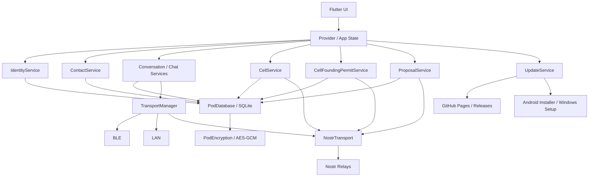

# N.E.X.U.S. OneApp — Entwicklerfreundlicher Implementierungsplan

**Stand:** 2. Mai 2026  
**Technischer Arbeitsstand:** v0.1.12-alpha  
**Ziel dieses Dokuments:** Ein neuer Entwickler soll verstehen, **was bereits gebaut ist**, **wie die App grundsätzlich funktioniert**, **wo die wichtigsten Codebereiche liegen** und **was als Nächstes sinnvoll ist**.

Dieses Dokument ersetzt nicht den Bauplan. Es übersetzt den Bauplan und den bisherigen Implementierungsstand in eine technische Arbeitslandkarte.

---

## 1. In einem Satz

Die N.E.X.U.S. OneApp ist aktuell eine dezentrale Flutter-App für Identität, Kontakte, Chat, Kanäle, Dorfplatz, Zellen und erste Governance-Strukturen. Der nächste große technische Schritt ist **G2: echte Liquid-Democracy-Governance**.

---

## 2. Was die App heute schon kann

Aus Entwicklersicht besteht die App aktuell aus sechs großen Funktionsblöcken.

| Bereich | Was er tut | Status |
|---|---|---|
| Identität | Seed Phrase, DID, Pseudonym, Profil, Selective Disclosure | ✅ stabiler Alpha-Kern |
| Kommunikation | Chat, Kontakte, Gruppen, Kanäle, Dorfplatz | ✅ weitgehend umgesetzt |
| Transport | Nostr, LAN, BLE als dezentrale Transportwege | ✅ vorhanden, BLE noch nicht vollwertiges Multi-Hop-Mesh |
| Lokaler Datentresor | SQLite / Proto-POD mit verschlüsselten `enc`-Payloads | ✅ vorhanden, Restore noch offen |
| Zellen / G1 | Lokale und thematische Zellen, Beitrittsanfragen, Rollen, Proposals | ✅ vorhanden |
| Updates | Update-Check, Download, SHA256-Prüfung, Installer-Übergabe | ✅ v0.1.12 erweitert |

Wichtig: Die App ist kein reiner Messenger. Der Messenger ist die Einstiegsschicht. Darauf bauen Zellen, Governance und später AETHER / VITA / TERRA / AURA auf.

---

## 3. Mentales Modell: Wie die App gedacht ist

Die App folgt einem einfachen Grundprinzip:

```text
Mensch
  → eigene Identität
  → lokale verschlüsselte Daten
  → Kontakte und Kommunikation
  → Zellen
  → Proposals
  → spätere echte Governance
```

Technisch bedeutet das:

```text
Flutter UI
  → Provider / Services
  → lokale SQLite-Datenbank
  → Verschlüsselung
  → TransportManager
  → Nostr / LAN / BLE
```

Die UI soll nie direkt „das Netzwerk“ kontrollieren. Sie ruft Services auf. Die Services speichern lokal und veröffentlichen bei Bedarf über Transport/Nostr.

---

## 4. Grobe Architektur



---

## 5. Wo ein Entwickler anfangen sollte

Nicht mit den schwierigsten Dateien beginnen.

### Gute Einstiegsdateien

| Datei | Warum geeignet |
|---|---|
| `lib/services/update_service.dart` | relativ isoliert, gut testbar, guter Einstieg in Service-Pattern |
| `lib/shared/widgets/update_bottom_sheet.dart` | UI + Service-Anbindung, überschaubar |
| `lib/features/governance/cell_founding_permit.dart` | kleines Datenmodell, gut verständlich |
| `lib/features/governance/cell_founding_permit_service.dart` | gutes Beispiel für DB + Nostr + State |
| `lib/features/governance/request_cell_permit_screen.dart` | Formular-UI mit realem Flow |

### Erst später anfassen

| Datei | Warum vorsichtig |
|---|---|
| `lib/core/transport/nostr/nostr_transport.dart` | sehr zentral, viele Event-Kinds, hohe Fehlerwirkung |
| `lib/core/storage/pod_database.dart` | Migrationen können Daten beschädigen |
| `lib/features/governance/proposal_service.dart` | G2-kritisch, Race-Conditions und Audit-Log wichtig |
| `lib/features/governance/cell_service.dart` | Zellen, Rollen, Membership, Nostr-Sync |

---

## 6. Codebereiche im Überblick

### 6.1 `core/`

`core/` enthält technische Grundlagen, die viele Features nutzen.

```text
lib/core/
  identity/      → Seed, DID, Identität
  crypto/        → Verschlüsselung / Keys
  storage/       → SQLite, Migrationen, PodDatabase
  transport/     → Nostr, LAN, BLE, TransportManager
  roles/         → Rollen und Berechtigungen
  router.dart    → Navigation
```

Regel: Änderungen in `core/` haben oft viele Seiteneffekte. Erst verstehen, dann anfassen.

### 6.2 `features/governance/`

Hier liegen Zellen, Proposals und die Vorbereitung für G2.

```text
cell.dart
cell_service.dart
cell_member.dart
cell_join_request.dart

cell_founding_permit.dart
cell_founding_permit_service.dart
request_cell_permit_screen.dart

proposal.dart
proposal_service.dart
vote.dart
decision_record.dart
```

Der Governance-Bereich ist aktuell zweigeteilt:

1. **G1:** Zellen + Proposals als Grundstruktur.
2. **G2:** Liquid Democracy, Delegation, Quadratic Voting — vorbereitet, aber noch nicht fertig.

### 6.3 `services/update_service.dart`

Der Update-Prozess ist inzwischen smarter:

1. App lädt `version.json`.
2. App erkennt neue Version.
3. Nutzer bestätigt Download.
4. App lädt APK/EXE.
5. Optionaler SHA256-Check.
6. Android öffnet APK-Installer.
7. Windows startet Setup.exe.

Wichtig: Es gibt keine stille Installation. Der Nutzer bestätigt immer über das Betriebssystem.

---

## 7. Aktueller Stand nach v0.1.12-alpha

### 7.1 Neu: Cell Founding Permit System

Problem vorher:

- Nur Admin/System-Admin konnte Zellen gründen.
- Für thematische Zellen war das okay.
- Für lokale Zellen war es falsch, weil lokale Zellen echte GPS-/Geohash-Daten vom Gerät des zukünftigen Founders brauchen.

Neue Lösung:

```text
Nutzer beantragt Zellgründung
  → Admin genehmigt Gründungsfreigabe
  → Nutzer gründet Zelle selbst auf seinem Gerät
  → Nutzer wird Founder
  → Permit wird als used markiert
```

Technisch:

- neues Modell `CellFoundingPermit`,
- verschlüsselt im Proto-POD (`enc`),
- Nostr Kind-31006,
- Admin kann genehmigen, ablehnen, widerrufen,
- Nutzer sieht aktive Freigabe,
- lokale Geodaten entstehen erst beim tatsächlichen Gründen.

Das wurde manuell getestet:

```text
Windows-Testuser beantragt Zellgründung
  → Android-Admin genehmigt
  → Windows-Testuser gründet lokale Zelle
  → Permit wird verbraucht
```

### 7.2 Neu: Smarter Update-Prozess

Vorher:

```text
Update erkannt
  → Nutzer muss selbst GitHub öffnen
  → manuell herunterladen
```

Jetzt:

```text
Update erkannt
  → Nutzer klickt „Jetzt herunterladen“
  → App lädt Datei selbst
  → Progressbar
  → optional SHA256-Prüfung
  → Android Installer oder Windows Setup wird geöffnet
```

Das reduziert Reibung für nicht-technische Nutzer deutlich.

---

## 8. Nostr Event-Kinds

Die App verwendet Nostr nicht nur für Chat, sondern auch für Zellen, Rollen, Proposals und Permits.

| Kind | Verwendung |
|---|---|
| 0 | Profil-Sync |
| 1 | Dorfplatz-Posts / Kommentare |
| 4 | verschlüsselte DMs / Kontaktanfragen |
| 5 | Delete Events |
| 6 | Reposts |
| 7 | Reaktionen |
| 28/40 | Gruppenkanäle |
| 30000 | Zellen-Announcements |
| 31001 | Rollen-Zuweisungen |
| 31002 | Kanal-Rollen |
| 31003 | Zellen-Beitrittsanfragen |
| 31004 | Mitgliedschafts-Bestätigung |
| 31005 | Mitglieder-Leave / Remove / Joined Broadcast |
| 31006 | Cell Founding Permits |
| 31010 | Proposals |
| 31011 | Votes |
| 31013 | Decision Records |

Wichtig: `e`-Tags dürfen nur echte 64-Hex-Nostr-Event-IDs enthalten. Interne IDs gehören in Custom-Tags.

---

## 9. Aktuelle technische Restpunkte

### Kritisch vor größerem Release

| Thema | Warum wichtig |
|---|---|
| Restore-Flow | Seed-Restore muss zuverlässig Backup-Recovery anbieten |
| Backup-Speicherort | Backup darf bei Neuinstallation nicht verloren gehen |
| Release-Signing Android | Externe APKs dürfen nicht mit Debug-Signing verteilt werden |

### Kritisch vor produktivem G2

| Thema | Warum wichtig |
|---|---|
| G2-Spezifikation | Ohne klare Regeln keine saubere Implementierung |
| Relay-ACK / PublishResult | Governance-Events müssen nachweisbar akzeptiert werden |
| Audit-Log append-only | Governance-Geschichte darf nicht gelöscht werden |
| Hybrid-Governance-Schema | sensible Inhalte verschlüsseln, technische Indexdaten sichtbar lassen |
| Tally-Engine | Liquid Democracy und Quadratic Voting sind noch nicht fertig |

### Später / Komfort

| Thema | Warum |
|---|---|
| Retry-Queue | fehlgeschlagene Permit-/Governance-Events automatisch erneut senden |
| NIP-44 v2 | NIP-04-Fallback langfristig ersetzen |
| Multi-Device-Sync | Nutzer will Daten auf mehreren Geräten |
| WebRTC Calls | Sprach-/Videotelefonie |
| i18n | Mehrsprachigkeit |

---

## 10. G2: Was als Nächstes wirklich kommt

G2 ist nicht „ein paar Buttons für Abstimmung“. G2 ist das Governance-Herz der App.

G2 braucht:

1. direkte Abstimmung,
2. Delegation pro Proposal,
3. Quadratic Voting,
4. Quoren,
5. Superadmin-Abwahl,
6. Audit-Log,
7. saubere Nostr-Synchronisation,
8. Schutz vor Machtkonzentration.

Aktueller Zustand:

- Tabellen und Felder sind vorbereitet,
- Votes existieren,
- Proposal-Lifecycle existiert,
- aber Gewichtung, Delegation und QV werden noch nicht wirklich berechnet.

Darum ist der nächste sinnvolle Schritt nicht sofort Code, sondern:

```text
G2-Spezifikation
  → PublishResult / Relay-ACK
  → Audit-Log append-only
  → Hybrid-Schema
  → Tally-Engine
  → UI
```

---

## 11. Kritische Entwicklungsregeln

Diese Regeln sind nicht optional.

### Nicht tun

```text
kein flutter clean
kein adb uninstall
kein flutter install
kein DROP TABLE
kein unkontrolliertes Löschen von Build-/Datenordnern
keine internen UUIDs in Nostr e-Tags
keine Keys oder Seeds in Logs
```

### Immer beachten

```text
State vor erstem await sichern
Listener vor Transport-Start registrieren
Migrationen nur additiv
private Daten verschlüsseln
auf Gerät testen, bevor gepusht wird
```

---

## 12. Tests und Qualität

Nach Änderungen immer mindestens:

```bash
flutter analyze <betroffene Datei>
```

Bei Services:

```bash
flutter test test/services/...
```

Bei Governance:

```bash
flutter test test/cell_founding_permit_test.dart
flutter test test/cell_founding_permit_integration_test.dart
```

Bei UI-Änderungen zusätzlich manuell testen.

---

## 13. Git / Commit-Regeln

Nicht committen:

```text
*.apk
*.aab
*.zip
nuget.exe
.tmp.driveupload/
build/
temporäre Audit-Dateien
```

Vor Commit:

```bash
git status
git diff --cached --name-only
```

Push-Regel:

```bash
git push origin master:main
```

---

## 14. Wie man eine Aufgabe richtig angeht

Für neue Entwickler:

1. Aufgabe klein schneiden.
2. Betroffene Dateien identifizieren.
3. Bestehendes Pattern suchen.
4. Plan machen.
5. Kleine Änderung implementieren.
6. Analyze ausführen.
7. Tests ausführen.
8. Manuell prüfen.
9. Erst dann committen.

Nicht: „Ich lese mal alles und baue dann etwas Großes.“

---

## 15. Zusammenfassung für Entwickler

Wenn du neu ins Projekt kommst, musst du nicht sofort den Bauplan verstehen.

Verstehe zuerst diese Kette:

```text
Identität
  → lokale Daten
  → Kommunikation
  → Zellen
  → Proposals
  → G2
```

Die App ist heute bereits eine funktionierende dezentrale Alpha-Plattform. Die wichtigsten nächsten Arbeiten sind Stabilisierung, G2-Spezifikation und eine sichere Governance-Implementierung.

Der beste Einstieg ist ein kleiner, isolierter Bereich wie Update-System oder Cell Founding Permits. Danach kann man sich schrittweise in Zellen, Proposals und Nostr einarbeiten.
