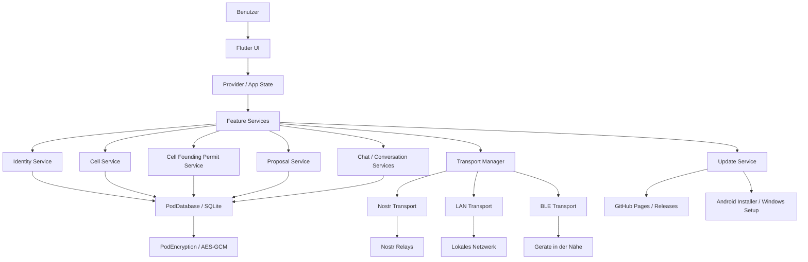

# N.E.X.U.S. OneApp — Developer Onboarding

Willkommen im N.E.X.U.S.-OneApp-Projekt.

Dieses Dokument ist der Einstiegspunkt für neue Entwickler. Es soll nicht jedes Detail erklären, sondern Orientierung geben: Was ist die App, wie ist sie aufgebaut, welche Regeln sind wichtig und womit beginnt man sinnvoll?

---

## 1. Kurzüberblick

Die **N.E.X.U.S. OneApp** ist eine dezentrale, Offline-First Flutter-App für:

- selbstsouveräne digitale Identität,
- sichere Kommunikation,
- Kontakte und Vertrauensstufen,
- Gruppen und Kanäle,
- Dorfplatz / Social Feed,
- lokale und thematische Zellen,
- Zellgründungsfreigaben,
- erste Governance-Strukturen,
- zukünftige Liquid Democracy / G2.

Die App läuft aktuell auf:

- Android,
- Windows.

Der technische Kern ist:

- Flutter / Dart,
- Provider,
- GoRouter,
- SQLite / Proto-POD,
- Nostr,
- LAN,
- BLE,
- lokale Verschlüsselung.

---

## 2. Was aktuell funktioniert

Aktuell vorhanden oder weitgehend umgesetzt:

- Onboarding mit Seed Phrase,
- dezentrale Identität mit DID,
- Profil und Pseudonym,
- Kontakte und Vertrauensstufen,
- Chat,
- Kanäle und Gruppen,
- Dorfplatz,
- Zellen-Hub,
- lokale und thematische Zellen,
- Beitrittsanfragen,
- Rollen-System,
- Proposals als G1-Governance-Grundlage,
- Cell Founding Permit System,
- automatischer Update-Checker,
- In-App-Download von Updates mit Installer-Übergabe,
- lokales verschlüsseltes Backup-Grundsystem.

---

## 3. Wichtige Projektregeln

Diese Regeln sind kritisch und dürfen nicht ohne Rücksprache gebrochen werden.

### Datenbank

- Niemals `DROP TABLE` verwenden.
- Nur `CREATE TABLE IF NOT EXISTS` und `ALTER TABLE`.
- Migrationen müssen rückwärtskompatibel sein.
- Private Daten gehören verschlüsselt in `enc`-Payloads.

### Flutter / Geräte

- Kein `flutter clean` ohne ausdrückliche Freigabe.
- Kein `adb uninstall`.
- Kein `flutter install`.
- Für Tests auf Android: `flutter run`.
- Windows-Build-Probleme nicht durch destruktive Maßnahmen lösen.

### Async / Nostr

- In-Memory-State muss synchron vor dem ersten `await` gesetzt werden.
- Broadcast-Listener müssen vor Transport-Start registriert sein.
- Nostr `e`-Tags dürfen nur echte 64-Hex-Nostr-Event-IDs enthalten.
- Interne UUIDs gehören in Custom-Tags wie `cell_id`, `proposal_id`, `channel_id`.

### UI / Sprache

- UI-Texte auf Deutsch mit echten Umlauten.
- Code-Kommentare auf Englisch.
- AETHER-Nomenklatur beachten: keine Begriffe wie `money`, `payment`, `price` für N.E.X.U.S.-Logik.

---

## 4. Architektur — grobe Übersicht



---

## 5. Ordnerstruktur — vereinfacht

```text
lib/
  core/
    identity/        → DID, Seed, Identität
    crypto/          → Verschlüsselung, Keys
    storage/         → SQLite / PodDatabase
    transport/       → Nostr, LAN, BLE, TransportManager
    roles/           → Rollen und Berechtigungen
    router.dart      → App-Routen

  features/
    governance/      → Zellen, Proposals, Permits, G1/G2-Basis
    chat/            → Chat-UI und Chat-Logik
    contacts/        → Kontakte, Vertrauen, Anfragen
    feed/            → Dorfplatz / Social Feed
    profile/         → Profil, Sichtbarkeit, Identität im UI
    settings/        → Einstellungen, Adminbereiche

  services/
    update_service.dart → Update-Check, Download, Installer-Übergabe

  shared/
    widgets/         → Wiederverwendbare UI-Komponenten
```

---

## 6. Empfohlener Lesepfad für neue Entwickler

Bitte nicht mit `nostr_transport.dart` beginnen. Das ist einer der komplexesten Bereiche.

### Schritt 1 — leichter Einstieg

1. `lib/services/update_service.dart`
2. `lib/shared/widgets/update_bottom_sheet.dart`

Warum?

Der Update-Prozess ist relativ isoliert, gut testbar und leichter verständlich.

### Schritt 2 — mittlerer Einstieg

3. `lib/features/governance/cell_founding_permit.dart`
4. `lib/features/governance/cell_founding_permit_service.dart`
5. `lib/features/governance/request_cell_permit_screen.dart`

Warum?

Das Cell Founding Permit System ist ein gutes Beispiel für:

- Datenmodell,
- verschlüsselte Speicherung,
- Nostr-Sync,
- UI,
- Admin-Flow,
- Berechtigungen.

### Schritt 3 — tiefer Einstieg

6. `lib/features/governance/cell_service.dart`
7. `lib/features/governance/proposal_service.dart`

Warum?

Hier beginnt die Kernlogik für Zellen und Governance.

### Schritt 4 — nur mit Begleitung

8. `lib/core/transport/nostr/nostr_transport.dart`
9. `lib/core/storage/pod_database.dart`

Warum?

Diese Dateien sind zentral, komplex und fehlerkritisch.

---

## 7. Erste sinnvolle Aufgaben für neue Entwickler

Neue Entwickler sollten mit kleinen, klar abgegrenzten Aufgaben beginnen.

Geeignete Einstiegsaufgaben:

- UI-Feinschliff im Update-Bottom-Sheet,
- kleine Tests für UpdateService erweitern,
- Ablaufdatum von Gründungsfreigaben schöner anzeigen,
- leere Zustände im Adminbereich verbessern,
- README-/Dokumentationspflege,
- kleine Bugfixes in isolierten Widgets.

Nicht geeignete Einstiegsaufgaben:

- Nostr-Protokoll ändern,
- Datenbankmigrationen schreiben,
- Verschlüsselung ändern,
- Proposal-Tally / G2-Logik anfassen,
- TransportManager umbauen.

---

## 8. Wichtige aktuelle Systeme

### 8.1 Update-System

Verantwortlich:

- `UpdateService`,
- `update_bottom_sheet.dart`,
- GitHub Pages / Releases,
- Android APK,
- Windows Setup.exe.

Aktueller Flow:

1. App prüft `version.json`.
2. Neue Version wird erkannt.
3. Nutzer sieht Hinweis.
4. Nutzer bestätigt Download.
5. App lädt APK/EXE herunter.
6. SHA256 wird optional geprüft.
7. Installer wird geöffnet.
8. Nutzer bestätigt Installation.

### 8.2 Cell Founding Permit System

Ziel:

Normale Nutzer sollen nicht beliebig Zellen gründen können. Gleichzeitig darf der Admin lokale Zellen nicht stellvertretend gründen, weil lokale Zellen echte Geodaten vom Gerät des zukünftigen Founders brauchen.

Flow:

1. Nutzer stellt Gründungsantrag.
2. Admin sieht Antrag.
3. Admin genehmigt oder lehnt ab.
4. Bei Genehmigung erhält der Nutzer eine Gründungsfreigabe.
5. Nutzer gründet Zelle selbst auf seinem Gerät.
6. Permit wird als `used` markiert.

### 8.3 Governance G1 / G2

Aktuell:

- G1 ist vorhanden: Zellen + Proposals.
- G2 ist vorbereitet, aber noch nicht fertig.

G2 soll später enthalten:

- direkte Abstimmung,
- Liquid Democracy,
- Delegation,
- Quadratic Voting,
- Superadmin-Abwahl,
- Audit-Log,
- bessere Relay-ACKs,
- Hybrid-Schema für sensible Governance-Daten.

---

## 9. Typischer Entwicklungsablauf

1. Issue oder Aufgabe lesen.
2. Relevante Dateien identifizieren.
3. Bestehendes Pattern suchen.
4. Kleine Änderung planen.
5. Änderung implementieren.
6. `flutter analyze` für betroffene Dateien ausführen.
7. Relevante Tests ausführen.
8. Manuell testen, wenn UI oder Plattform betroffen ist.
9. `git status` prüfen.
10. Keine Build-Artefakte committen.
11. Commit mit klarer Message.

---

## 10. Git-Regeln

Nicht committen:

- `.apk`,
- `.aab`,
- `.exe`,
- `.zip`,
- `nuget.exe`,
- `.tmp.driveupload/`,
- Build-Ordner,
- temporäre Audit-Dateien.

Vor Commit:

```bash
git status
git diff --cached --name-only
```

Push-Regel:

```bash
git push origin master:main
```

---

## 11. Aktuelle technische Restpunkte

Wichtige offene Themen:

- Restore-Flow verbessern,
- Backup-Speicherort robuster machen,
- Relay-ACK / PublishResult einführen,
- Audit-Log append-only machen,
- G2-Governance-Spezifikation finalisieren,
- Hybrid-Governance-Schema für sensible Daten,
- Retry-Queue für fehlgeschlagene Nostr-/Permit-/Governance-Events,
- NIP-04-Fallback langfristig durch NIP-44 v2 / X25519-AES-GCM ersetzen.

---

## 12. Mentale Landkarte

Die App ist kein klassisches Chat-Projekt. Sie ist der digitale Kern einer größeren Vision.

Dennoch gilt für Entwicklung:

- klein anfangen,
- bestehende Muster respektieren,
- keine zentralen Systeme ohne Grund anfassen,
- erst verstehen, dann ändern,
- immer testbar bleiben.

Der beste Einstieg ist nicht, das ganze System auf einmal zu verstehen. Der beste Einstieg ist, **einen kleinen, klaren Bereich gut zu verstehen und dort eine sichere Änderung zu machen**.

